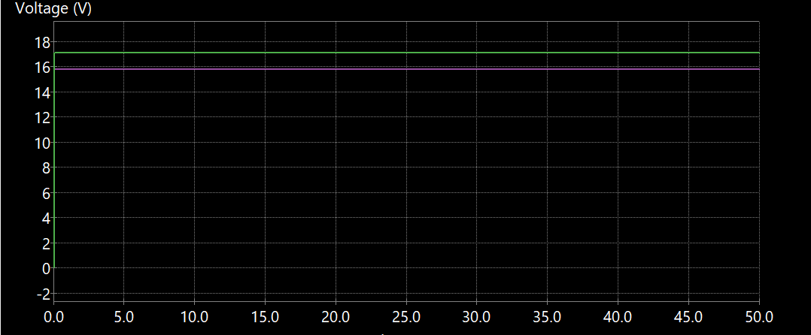
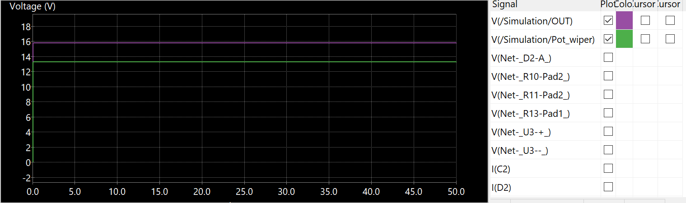
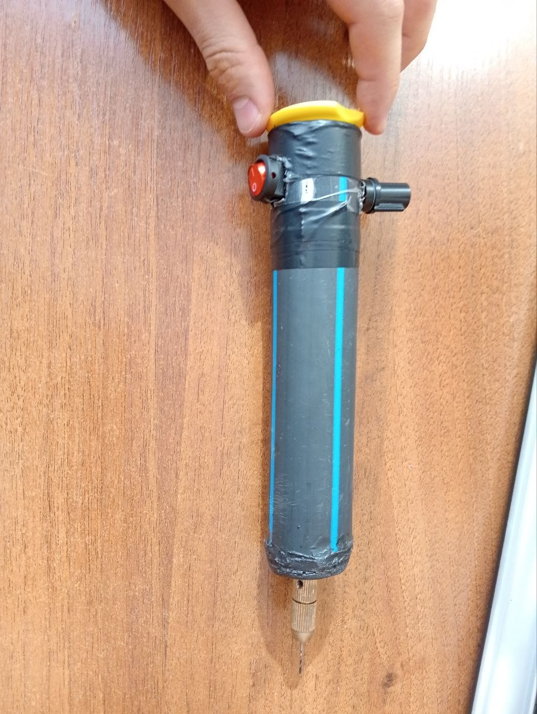
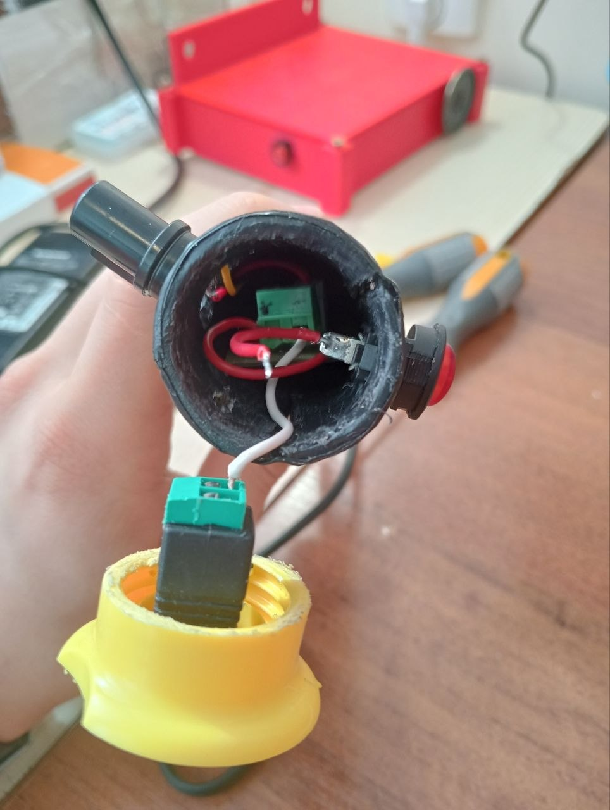
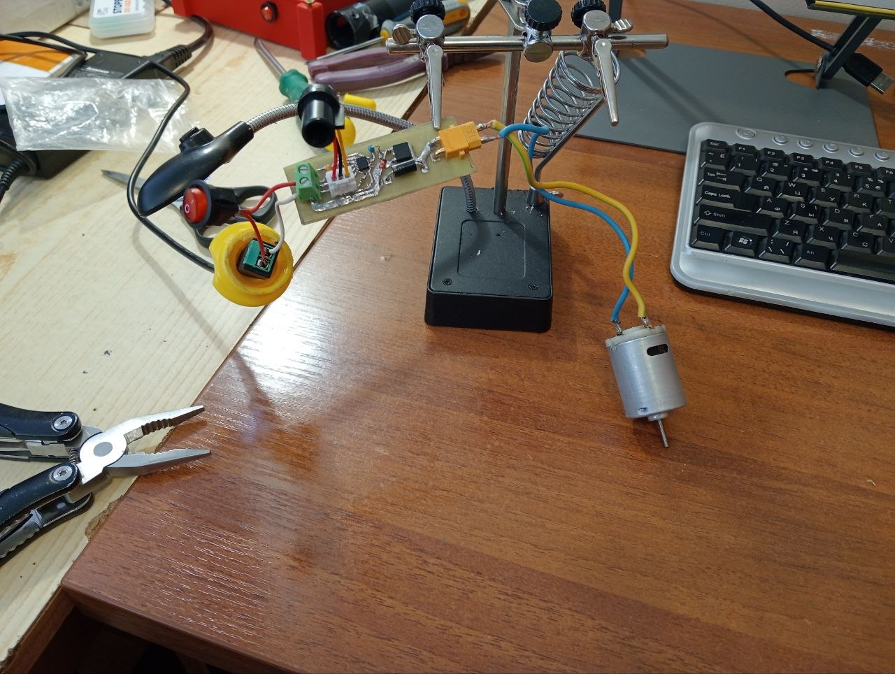
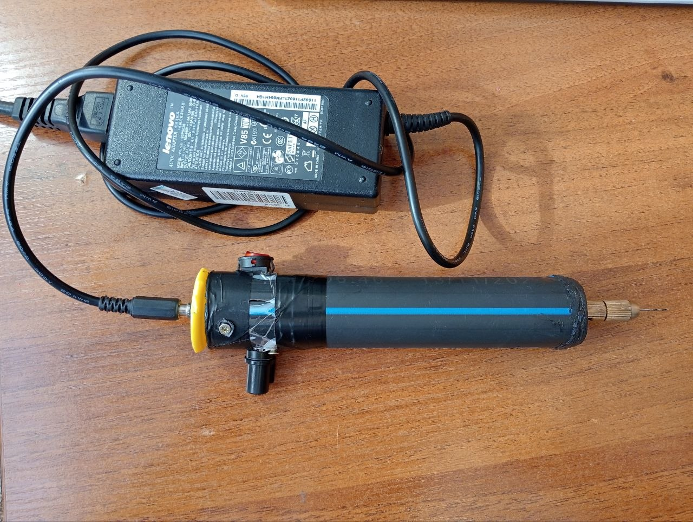
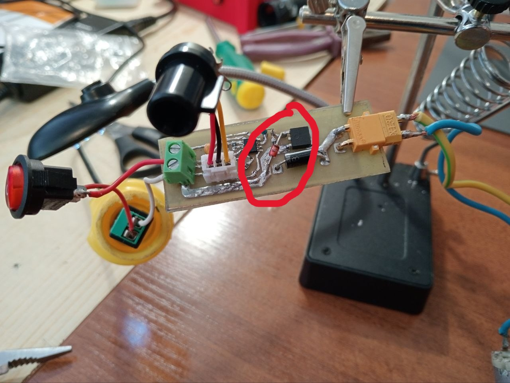

# Mini wiertarka

## 1. Opis zasady działania

**Cel:** Podczas domowej produkcji płytek powstała potrzeba wiercenia otworów w tekstolicie. Dlatego powstał pomysł zaprojektowania wiertarki wlaśnie do tych potrzeb. 

System składa się z trzech modułów:
1. **Zasilacza:** Zasilacz od laptopa 20V/4.5A
2. **Płytka modulacji szerokości impulsów:** Uklad służący do regulowania napięcia na silniku.
3. **Silnik:** Szczotkowy silnik RS385-17V

---

### Zasada działania płytki:

1. Pierwszy wzmacniacz w układzie scalonym LM358 pełni rolę komparatora z histerezą (zrealizowaną za pomocą dzielnika napięcia oraz rezystora w pętli dodatniego sprzężenia zwrotnego), generując napięcie piłokształtne na kondensatorze.

2. Drugi wzmacniacz w układzie LM358 działa jako komparator, porównując napięcie na kondensatorze z napięciem zadanym na potencjometrze. Na wyjściu powstaje przebieg prostokątny o regulowanej szerokości impulsów, który steruje tranzystorem MOSFET załączającym i wyłączającym silnik. Tranzystor jest chroniony przed przepięciami za pomocą szybkiej diody impulsowej.

---

## 2. Realizacja

### Wyniki symulacji (KiCAD)

1. **Przebieg napięcia na bramce tranzystora, gdy wartości rezystorów potencjometra były następujące: 3k/7k (górny/dolny):**

2. **Przebieg napięcia na bramce tranzystora, gdy wartości rezystorów potencjometra były następujące: 3k/7k (górny/dolny):**

### Obudowa

### Demonstracja wideo
[Link](https://www.youtube.com/watch?v=rtPFrEMRT7Q)

### Zmontowany prototyp
|  |  |
|--|--|
|  |  |

## 3. Problemy i napotkane trudności 

### Zidentyfikowane problemy:
* Zły dobór wartości rezystorów dzielnika napięcia oraz rezytora sprężenia zwrotnego spowodował, że w sterowaniu napięciem bierze udział nie cała ścieżka potencjometra, a tylko część. Rozwiązać ten problem można dobierając te wartości tak, żeby kondesator ładował się do ~20V oraz rozładowywał się do ~0V.

### Napotkane trudności:
#### 1. Symulacja 
* Najpierw podłączyłem wejście drugiego wzmaczniacza do wyjście pierwszego, a nie do węzła kondesatora, i dlatego regulacja była niemożliwa.

#### 2. Dóbór wartości
* Najpierw chciałem zastosować zasiłacz o wartości napięcia 12V, ale wartość maksymalnego prądu silnika (stall current = 5A) przekraczała możliwości zasiłacza. Dlatego wybrałem zasiłacz na 20V. Nie zauważyłem, że dla wybranego tranzystora LR3103 wartość napięcia między Gate a Source może wynosić maksymalnie 16v. Dlatego musiałem dolutować diodę Zenera, która stabilizuje napięcie na poziomie 10v.  

   
